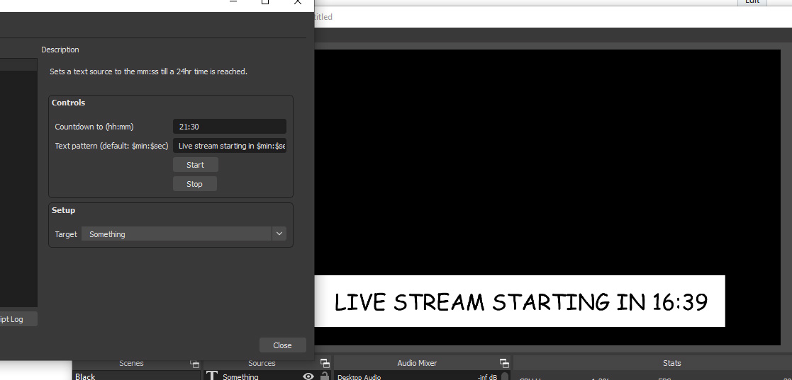

# obs-count-to-timer

An OBS script to count-to a time, rather down from a number. Useful for things
where the start time is exact - for church services for instance that start at
9am.

### Setup

Simply clone this repo, or download the lua file, and include it within OBS.
Then create a text source, and simply tell the script to point it at that.
